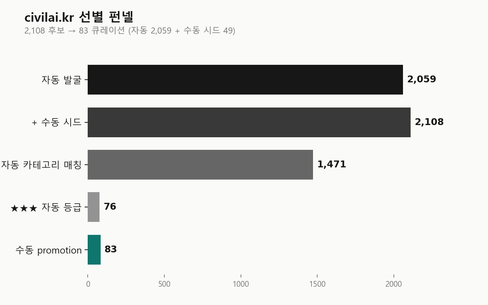
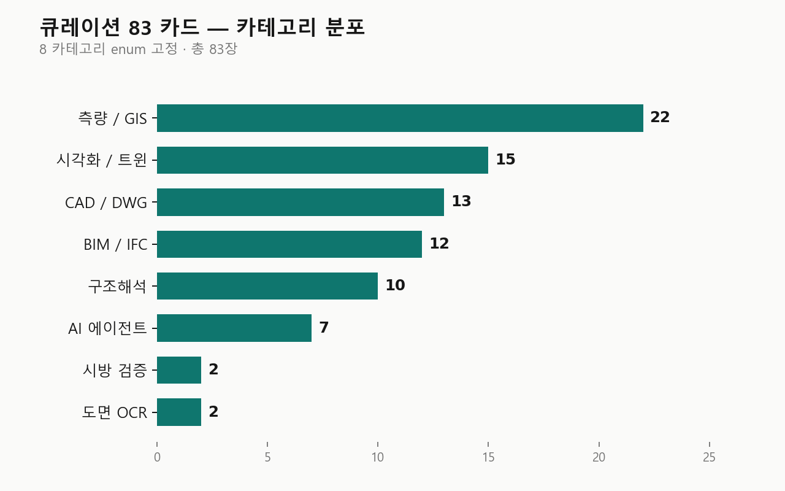
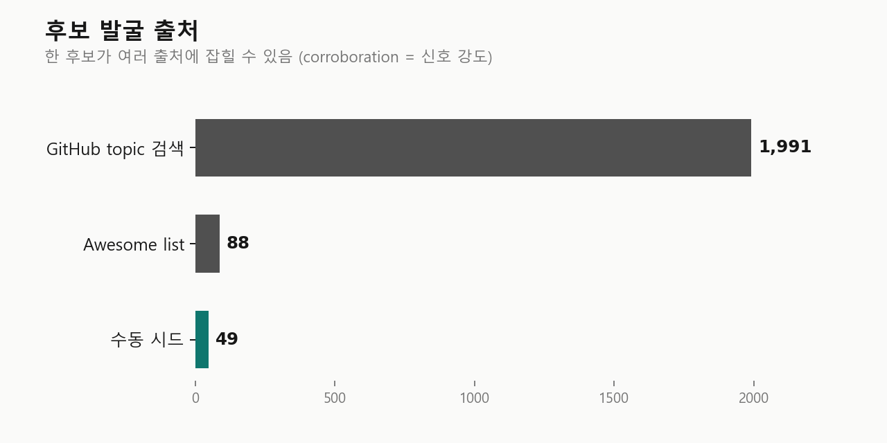

# CIVIL AI Korea Pack

> 글로벌 토목·건설 AI 오픈소스 **2108** 후보를 **83** 장으로 큐레이션. 그 *과정 전체* 를 자연어로 질의할 수 있는 데이터 자산.


원본 사이트 → [civilai.kr](https://civilai.kr) · 만든 사람 → [Lee (Seongmin)](https://tryseongmin.com) · [@trySeongmin](https://www.threads.com/@tryseongmin)

---

## 왜 이 팩

토목·건설 실무자가 *영문 awesome list* 와 *GitHub topic 검색* 을 직접 돌면 며칠 걸린다. 그 며칠을 **2,108 후보 → 83 큐레이션** 의 *결과* 와 **그 결과에 도달한 과정 전체** 로 압축했다.

- 큐레이션 **결과** → `selected/` (.md 83 장, 한국 KDS / KCS / BF / KOSHA 매핑 포함)
- 큐레이션 **과정** → `candidates.jsonl` + `selection_log.md` + `rejected_patterns.md` + `charts/`
- 자연어 **질의** → OpenCrab 인제스트로 hybrid retrieval (vector + BM25 + graph)

`결과` 만 있으면 *링크 모음* 이지만, `과정` 까지 같이 두면 *내 도메인에도 fork 가능한 데이터 자산* 이 된다.

---

## 선별 펀넬



| 단계 | 통과 | 비고 |
|---|---:|---|
| 자동 발굴 (`scripts/discover.ts`) | **2059** | awesome list 5 + GitHub topic 32 + 풀텍스트 search 9 |
| + 수동 시드 (Lee 가 사이트 빌드 중 직접 추가) | **2108** | discover 전 시점 |
| 자동 카테고리 매칭 (8 enum) | 1,471 | 키워드 1차 필터 — 자율주행 LiDAR / 회로 CAD 등 도메인 비매칭 제거 |
| 자동 ★ 등급 ★★★ | 76 | 별 + 활동 + corroboration 휴리스틱 |
| 수동 promotion + 시드 합산 | **83** | KDS / BF / KOSHA 매핑은 Lee 의 도메인 판단 |

`selection_log.md` 에 4 단계 필터 전 과정. `rejected_patterns.md` 에 7 가지 탈락 사유 패턴.

---

## 카테고리 분포 (선별 83 장)



SURVEY_GIS **22** ↔ SPEC_REVIEW **2** — 자동 발굴 풀의 GIS 편향 + 시방 검증 오픈소스 자체가 적은 현실이 그대로 분포에 반영. 큐레이션을 인위적으로 균등 분배하지 않고 *발견된 그대로* 두는 게 이 팩의 honest signal.

---

## 발굴 출처 분포 (2108 후보)



한 후보가 여러 출처에 동시에 잡힐 수 있다 (corroboration = 신호 강도). `candidates.jsonl` 의 `sources` 필드에 모든 출처가 누적되어 있어, "여러 awesome list 와 topic 양쪽 모두에 잡힌" 후보는 자동 ★★★ 등급에 가까워진다.

---

## 무엇이 이 안에

```
civil-ai-korea-pack/
├── selected/             # 83 카드 (.md) — 한국 적용 시나리오 + frontmatter 메타
├── candidates.jsonl      # 2108 후보 전체 (selected/rejected 상태)
├── selection_log.md      # 4 단계 필터 + Lee promotion 이력
├── rejected_patterns.md  # 7 가지 탈락 사유 패턴
├── charts/               # matplotlib 시각화 PNG 3장 + generate.py
├── queries/              # OpenCrab 5 질의 결과 (q1-q5.json + RESULTS.md)
└── posts/                # Threads 글 1/3-3/3 초안
```

### 카드 한 장의 모양

```yaml
---
name: "MCP4IFC"
slug: "mcp4ifc"
category: "BIM_IFC"
summary: "자연어로 IFC 모델 검증 + 질의"
github: "https://github.com/..."
license: "MIT"
language: "Python"
korean_applications:
  - "KDS 14 20 50 — 강구조 부재 단면 정보 자동 추출"
  - "BF 인증 — 출입구 / 경사로 IFC 속성 검증"
added: 2026-05-15
---
```

frontmatter 의 `korean_applications` 는 *자동 키워드 매칭이 아닌 Lee 의 도메인 판단* — KDS / KCS 조항, BF 인증, KOSHA 안전기준 등 한국 표준에 1대 1로 매핑.

---

## OpenCrab 인제스트 (검증됨)

```bash
# LocalCrab (local-first, SQLite + ChromaDB, 의존성 가벼움)
git clone https://github.com/AlexAI-MCP/OpenCrab && cd OpenCrab
pip install -e ".[dev]"
opencrab ingest -r -e .md,.jsonl /path/to/civil-ai-korea-pack
```

또는 [opencrab.sh](https://opencrab.sh) 호스팅 SaaS 의 "ingest from GitHub URL".

### 자연어 질의 5종 검증 결과

`queries/RESULTS.md` 전체. 다섯 질의 각각 vector 점수 상위 5건.

**Q1. 내가 누락한 BIM 도구가 있는지 점검**
```
assimp                0.938  Asset Import Library (3D 포맷 변환)
ifcopenshell          0.919  IFC 표준 라이브러리 본진
revitlookup           0.794  Revit BIM 디버깅
hypar-elements        0.778  parametric BIM elements
xeokit-bim-viewer     0.777  웹 IFC 뷰어
```

**Q2. 라이센스 불명 (NOASSERTION) 으로 탈락한 도구 중 재검토 후보**
```
README.md             1.000  (메타 문서, 자기 참조)
rejected_patterns.md  0.826  탈락 사유 패턴 본문
floorplan-analyzer    0.771  도면 OCR — license 없음
selection_log.md      0.753  선별 로그 본문
engineering-drawing-extractor 0.746
```

**Q3. 별 1,000 미만인데 큐레이션 포함된 도구의 공통 이유**
```
README.md             1.056
rejected_patterns.md  0.796
csftools              0.717  LiDAR 점군 — STALE 이지만 dependency 있음
dynamo                0.679  Revit / Civil 3D 시각 프로그래밍
floorplan-analyzer    0.659  도면 OCR
```

**Q4. 측량 / GIS 1차 통과 후 최종 탈락한 도구 패턴**
```
rejected_patterns.md  0.901
maptalks              0.799  2D/3D GIS — 자율주행 편향
blender-gis           0.790  Blender GIS — 환경 종속 큼
mapshaper             0.771  SHP/GeoJSON 도구
freecad-road          0.724  도로 설계 워크벤치
```

**Q5. 한국 KDS 검증 워크플로우에 묶을 수 있는 도구 조합** ★ 대표
```
mcp4ifc               0.907  자연어 IFC 모델 검증
text-to-cad           0.853  자연어 CAD 명령 에이전트
hollowrc              0.790  중공 RC 단면 설계
structuralcodes       0.774  Eurocode 식 (KDS 포팅 템플릿)
blueprints            0.719  토목 / 구조 규준 계산식
```

→ 사람이 손으로 묶어야 알았을 4 도구 조합을 hybrid retrieval (vector + BM25 + graph) 이 한 줄 질의로 점수와 함께 반환. 각 후보의 `korean_applications` frontmatter 가 graph edge 의 단서.

---

## 본인 큐레이션도 같은 방식으로

내 자산은 토목·건설 오픈소스지만, 같은 패턴이 다른 도메인에도 적용된다.

```
당신의 자산 ─→ candidates.jsonl + selected/*.md + selection_log.md ─→ OpenCrab ─→ 자연어 질의
```

이 repo 를 **template 으로 fork** 하면 본인 도메인 (전기 / 기계 / 화공 / 의료 / 디자인) 에 바로 맞출 수 있다.

조정할 것:
1. `candidates.jsonl` 의 schema 는 그대로 (`repo / sources / stars / status` 등)
2. `selected/*.md` frontmatter 의 `category` enum 을 본인 도메인 분류로 (8 개 enum 고정 권장)
3. `selection_log.md` 에 본인 필터 기준 단계별 기록 (자동 발굴 / 키워드 매칭 / 등급 / 수동 promotion)
4. `rejected_patterns.md` 에 본인 도메인의 탈락 사유 (라이센스 / 환경 종속 / 도메인 비매칭 등)
5. `charts/generate.py` 의 카테고리 라벨만 본인 enum 에 맞춰 교체

오픈소스 큐레이션을 *자산화* 하는 게 목적이지, 토목·건설만이 정답이 아니다.

---

## 갱신 흐름

원본 사이트 ([civilai.kr](https://civilai.kr)) 의 `src/content/library/ko/` 가 single source of truth.
이 팩은 사이트 repo 의 [`scripts/build-pack.ts`](https://github.com/chadolmin01/civil-ai-korea/blob/main/scripts/build-pack.ts) 로 자동 생성.

```
사이트 컨텐츠 변경 ─→ npm run build:pack ─→ 이 repo 자동 갱신 ─→ OpenCrab 재인제스트
```

차트는 별도 흐름: `cd charts && python generate.py` (matplotlib + 한글 폰트 필요).

---

## 만든 사람

- [Lee (Seongmin)](https://tryseongmin.com) · [@trySeongmin](https://www.threads.com/@tryseongmin) (Threads)
- 원본 사이트: [civilai.kr](https://civilai.kr)
- 이슈 / 제안: [GitHub Issues](https://github.com/chadolmin01/civil-ai-korea-pack/issues)

## 영감

- [@alex_ai_mcp](https://github.com/AlexAI-MCP) 의 **OpenCrab** — 자연어 질의 데이터 팩 인프라
- [@logotekton](https://www.threads.com/@logotekton) — *큐레이션 자체가 데이터 자산* 관점

## 라이센스

- 콘텐츠 (`selected/`, `selection_log.md`, `rejected_patterns.md`, `posts/`) — **CC BY-SA 4.0**
- 스크립트 (`charts/generate.py`, `queries/summarize.py`) — **MIT**
- `candidates.jsonl` 의 메타데이터 (별 / 라이센스 / 활동 등) — GitHub 공개 API 원천, fair use
